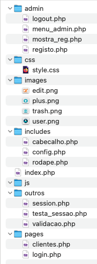

# 🎓 PAP - HumaniCare

## 👤 Informação do Aluno
**Nome:** David Barros  
**Número:** 2
**Curso:** Profissional de Informática - Sistemas
**Ano Letivo:** 2025/2026 
**Orientador:** Diana carneiro , Rosa Santo e Patricia

## 📋 Descrição do Projeto
[Descreve brevemente o teu projeto em 2-3 frases. Exemplo:]  
Este projecto tem como objectivo o desenvolvimento de uma aplicação web para a gestão de voluntariado.
A plataforma será destinada a aproximar organizações sem fins lucrativos de voluntários interessados em
participar em diferentes iniciativas sociais.

## 🎯 Objetivos Principais
- [ ] Identificar as necessidades de instituições e voluntários em relação à gestão de oportunidades de voluntariado.
- [ ] Produzir documentação clara sobre o projeto e o seu desenvolvimento.
- [ ] Escolher tecnologias adequadas para o desenvolvimento do site (linguagens, frameworks, base de dados).
- [ ] Implementar funcionalidades como: registo de utilizadores, publicação de oportunidades, candidaturas e histórico de participação.
- [ ] Desenvolver uma interface gráfica intuitiva e acessível.
- [ ] Realizar testes de usabilidade e performance.

## 🛠️ Stack Tecnológica

### **Frontend**
- [ ] HTML5, CSS3, JavaScript
- [ ] Bootstrap/Tailwind CSS [ou outro framework]
- [ ] React/Vue.js [opcional]

### **Backend**
- [ ] Node.js/PHP/Python [escolher um]
- [ ] Express/Laravel/Django [framework]
- [ ] Autenticação JWT/Sessions

### **Base de Dados**
- [ ] MySQL/PostgreSQL
- [ ] ORM: Sequelize/Eloquent [conforme backend]

### **Outras Ferramentas**
- [ ] Git & GitHub
- [ ] Docker [opcional]
- [ ] VSCode

## 📁 Estrutura do Projeto

## 📊 *Funcionalidades Implementadas*

### ✅ Concluídas
- Sistema de registo e login
- Página inicial com listagem
- Perfil de utilizador
...

### 🔄 Em Desenvolvimento
- Funcionalidade de pesquisa
- Upload de ficheiros
...

### 📅 Planeadas
- API REST
- PWA
...

## 🗓️ Plano de Trabalho
Fase	Tarefas	Prazo	Estado
1	Planeamento e setup	DD/MM	✅
2	Desenvolvimento backend	DD/MM	🟡
3	Desenvolvimento frontend	DD/MM	🔴
4	Testes e deploy	DD/MM	🔴

## 📝 Relatório de Progresso
Última Atualização: [Data]
O que foi feito desde a última atualização:
- Implementada a funcionalidade X
- Corrigido bug Y
- Melhorado o design da página Z

## Próximos passos:
- Implementar feature A
- Escrever testes para B
- Otimizar performance C

## 🔗 Links Úteis
- Documentação - Documentação detalhada
- Trello/Planeamento - Quadro de tarefas
- Protótipo - Design no Figma

## 📞 Contacto
- Email: [teu.email@escola.com]
- GitHub: [@teuusername]

